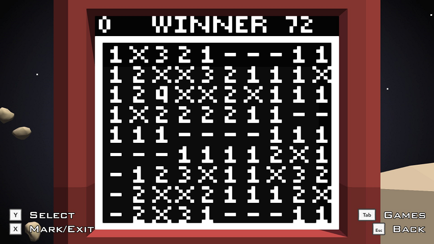

# Minesweeper
[Minesweeper](https://en.wikipedia.org/wiki/Minesweeper_(video_game)) arcade game for Redirection.

## Minesweeper
There's a given number of mines scatter randomly troughout the grid. Your goal is to uncover all the cells not containing a mine. The first cell you uncover is guaranteed not to contain one. When you uncover a mine you loose. Otherwise a clue indicating the number of adjacent mines (in 8 surronding squares) is shown. In addition to uncovering squares, you can mark those that contain mines for better orientation.

## Redirection robot arcade
Robot comprises 64×64 B/W screen, 4 directional joystick and two buttons. Arcade are programmed in Lua. In game the screen my look something like this
  
In this arcade, you can shoose the size of the grid (maximum that can fit on the screen at once is 10×9 but in can extend beyond the edges of the screen) and the number of mines.  
If you are interested, check it on [Steam workshop](https://steamcommunity.com/sharedfiles/filedetails/?id=1496182345).